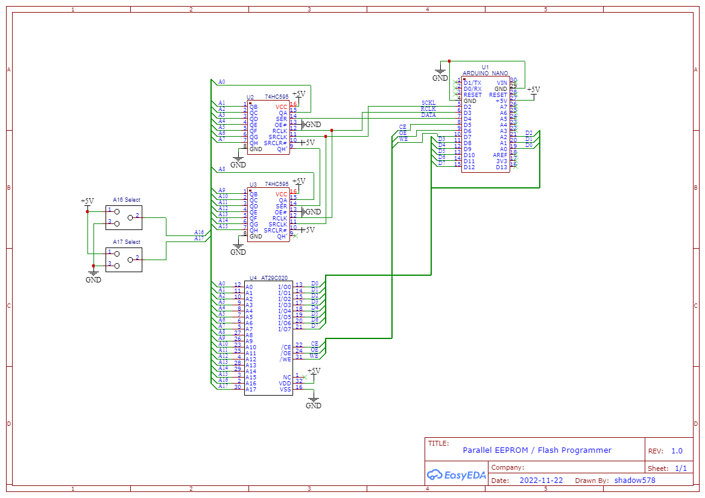

# Arduino Parallel EEPROM / Flash Programmer

This repo contains the design, firmware and companion software for a simple Parallel EEPROM / FLASH Programmer.

## Features
- single- Byte Read
- single- Byte Write
- pagewise Write

## Compatible ICs

The following ICs are tested to be compatible:
- AT28C256
- AT29C020

Other EEPROM / FLASH ICs should also work, but haven't been tested.

## Required Hardware

To build this Programmer, you'll need
- a Arduino Nano (or compatible)
- two 8-bit shift registers (74HC595)
- a parallel EEPROM / FLASH IC

Programmer Schematic

## License
> Copyright 2022 shadow578
> 
> Licensed under the Apache License, Version 2.0 (the "License");
> you may not use this file except in compliance with the License.
> You may obtain a copy of the License at
> 
> http://www.apache.org/licenses/LICENSE-2.0
> 
> Unless required by applicable law or agreed to in writing, > software
> distributed under the License is distributed on an "AS IS" BASIS,
> WITHOUT WARRANTIES OR CONDITIONS OF ANY KIND, either express or > implied.
> See the License for the specific language governing permissions > and
> limitations under the License.
